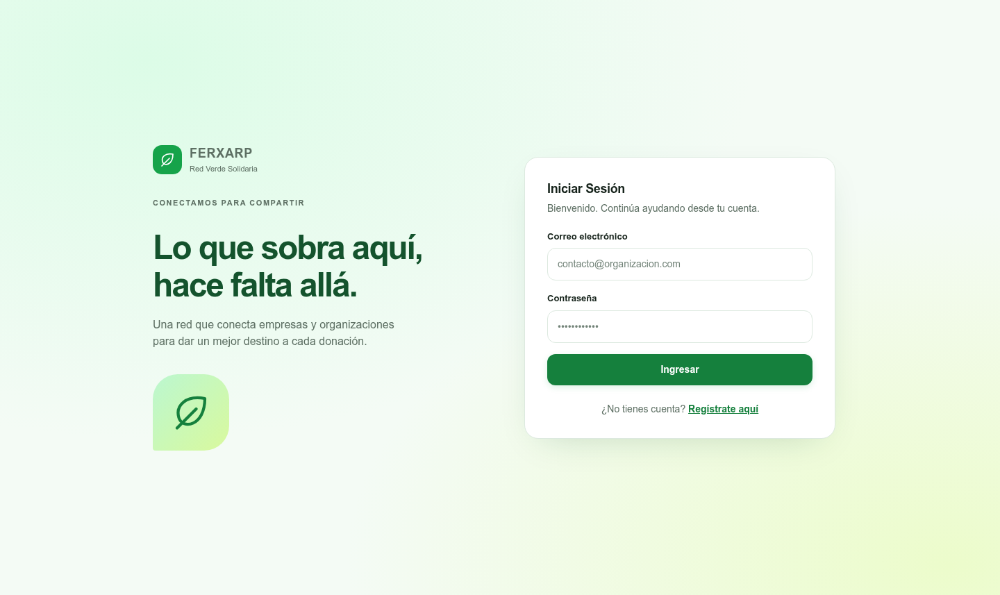
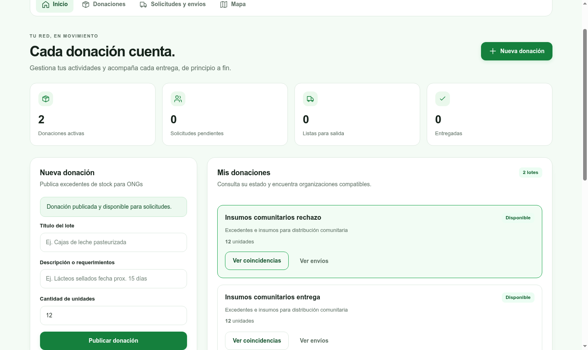
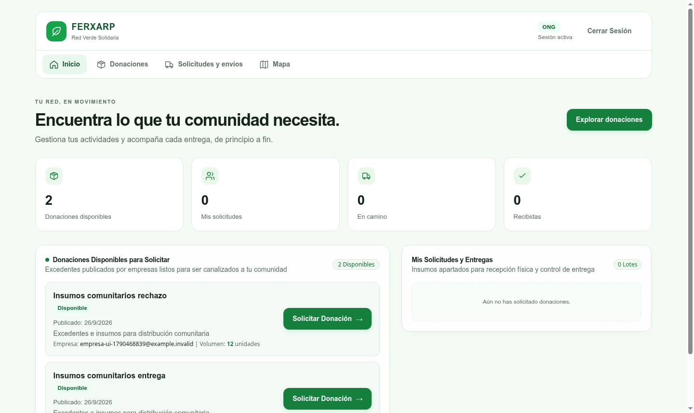
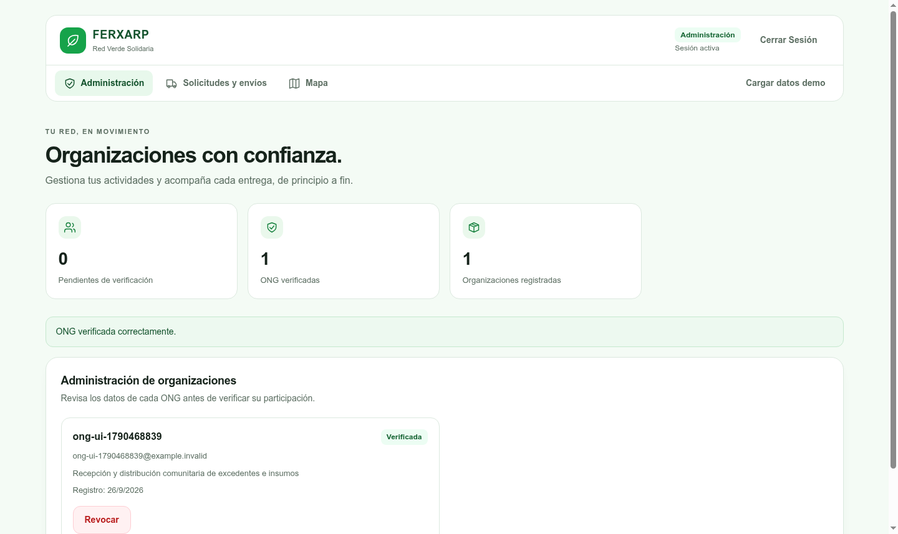
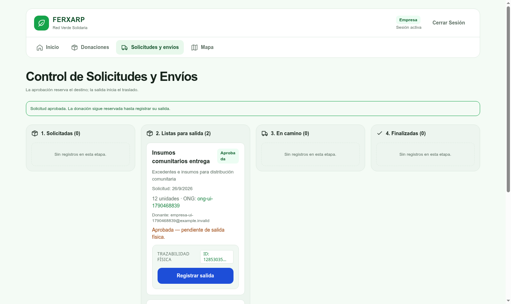
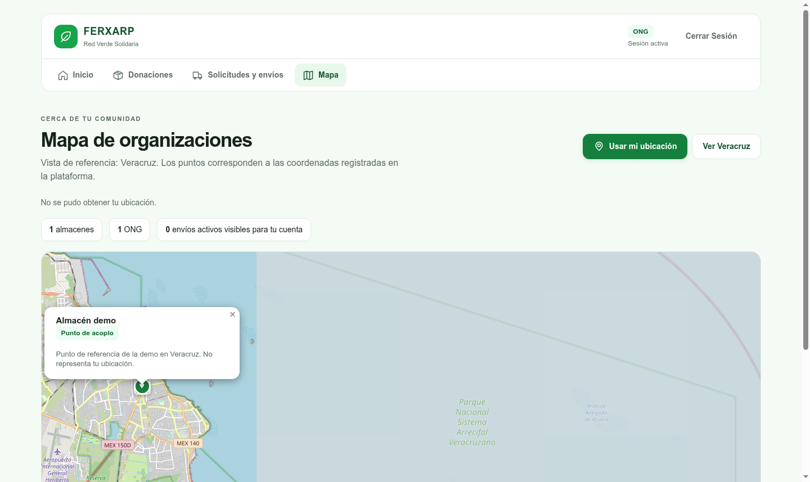
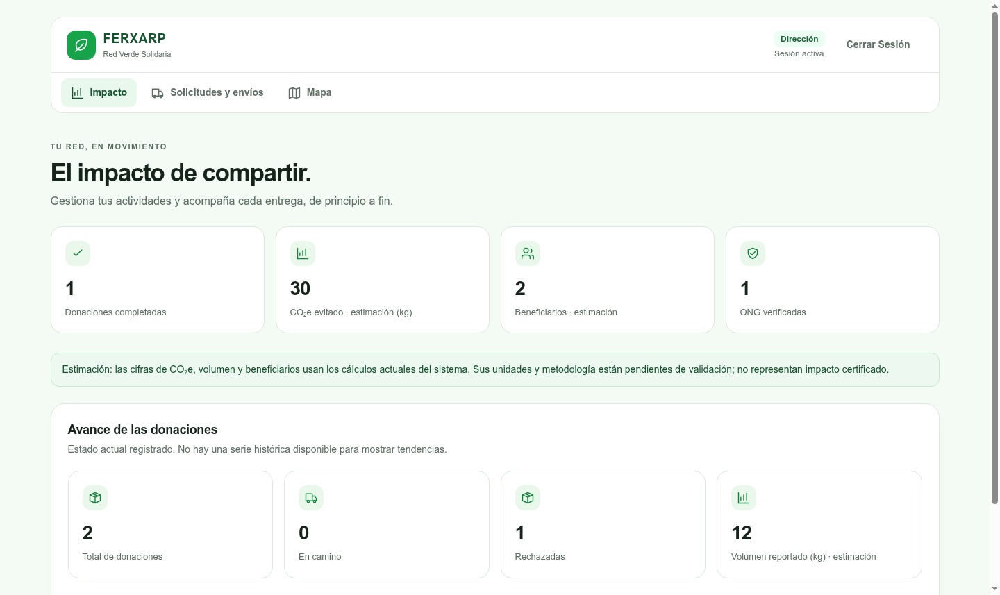

# Actividad final

## Implementación, seguridad, calidad y cierre de FERXARP

FERXARP — Red Verde Solidaria

Alumno: Rodrigo Couary Fortuno

Materia: Ingeniería de Software

Fecha: 26 de septiembre de 2026

Plataforma de distribución solidaria de excedentes

## Resumen ejecutivo

FERXARP es una aplicación web que vincula excedentes de empresas con organizaciones sociales verificadas. El módulo evaluado integra autenticación JWT, cuatro roles, autorización por propiedad y un ciclo de donación que separa la aprobación de una solicitud de la salida física. PostgreSQL conserva la información transaccional y ChromaDB funciona como índice derivado para un matching híbrido con alternativa léxica.

La evidencia final reúne 74 pruebas Rust y 44 pruebas Jest aprobadas. La cobertura de líneas del módulo escolar Rust es 85.91%; la del alcance configurado de Jest, 98.04%. Estos valores no describen la totalidad de las dos aplicaciones. GitHub Actions acreditó remotamente pruebas y construcciones en un pull request y, en main, un despliegue efímero con comprobaciones de servicio y limpieza. No se trata de producción.

La evaluación de seguridad combinó OWASP ZAP, solicitudes HTTP dirigidas y Chromium. Se corrigieron CORS permisivo, encabezados y un XSS almacenado en el mapa, descubierto mediante navegador. Persiste una alerta Medium por ausencia de CSP. SonarQube terminó con Quality Gate PASS en frontend y backend; sus métricas corresponden al corte ACT-03. El rediseño posterior Red Verde Solidaria incorporó validación responsive y un recorrido funcional con los principales roles.

El cierre compara alcance, secuencia e hitos comprobables en Git, sin calcular retrasos para los que no existe una línea base fechada. El plan conserva 25 acciones medibles y tres innovaciones futuras. El reporte responde a los cinco criterios de la actividad mediante resultados, límites y referencias concretas, sin asignar una calificación.

## Contenido

1. Introducción y contexto
2. Implementación del módulo y seguridad
3. Pipeline CI/CD
4. Pruebas de seguridad y calidad
5. Validación funcional y experiencia de usuario
6. Cierre del proyecto
7. Plan de mejora continua
8. Conclusión
9. Referencias / fuentes de evidencia

## 1. Introducción y contexto

### 1.1 Descripción de FERXARP

FERXARP — Red Verde Solidaria permite publicar excedentes, localizar organizaciones compatibles, solicitar una donación y registrar su traslado hasta la entrega o rechazo. La solución presenta vistas diferenciadas para Empresa, ONG, Administración y Dirección. Su alcance demostrado es una plataforma académica funcional y verificable en ambientes de prueba [1, 2].

### 1.2 Problema que atiende

La coordinación de excedentes requiere conocer qué se ofrece, quién puede recibirlo y en qué etapa se encuentra cada entrega. FERXARP atiende esa necesidad con inventario, verificación de organizaciones, solicitudes y bitácora. No se atribuyen reducciones de desperdicio, tiempos logísticos o emisiones que no hayan sido medidas. El panel de impacto conserva estimaciones identificadas como tales.

### 1.3 Objetivo general

Coordinar la distribución de excedentes de empresas hacia ONG verificadas, mediante solicitudes, seguimiento de entregas y trazabilidad, para facilitar su canalización a la comunidad beneficiaria.

### 1.4 Objetivo de la actividad final

El objetivo es demostrar cinco dimensiones de Ingeniería de Software: un módulo funcional protegido y probado; un pipeline automatizado; evaluación de seguridad y calidad; cierre sustentado en evidencias; y mejora continua con acciones verificables. La revisión utiliza código, historial Git, reportes JSON, documentación interna y capturas reales. El corte documental corresponde al commit 756728b del 26 de septiembre de 2026; cada medición conserva su fecha y alcance originales.

### 1.5 Partes interesadas

| Parte interesada | Interés o participación |
| --- | --- |
| Empresas donantes | Publicar excedentes y coordinar su asignación y salida. |
| ONG | Solicitar y recibir donaciones según sus necesidades. |
| Administración | Verificar organizaciones y supervisar los accesos administrativos. |
| Dirección/CEO | Consultar indicadores para orientar decisiones de gestión. |
| Equipo técnico | Mantener la aplicación, las pruebas, la seguridad y el despliegue. |
| Comunidad beneficiaria | Recibir los excedentes canalizados a través de las ONG. |

### 1.6 Arquitectura general

El navegador consume una API Rust/Axum. El backend modular centraliza autorización y reglas de negocio, persiste con SQLx en PostgreSQL y consulta ChromaDB para similitud vectorial. Docker Compose orquesta cuatro servicios. Aunque la documentación inicial menciona Supabase y microservicios, la evidencia evaluada utiliza PostgreSQL local y un backend modular, no una operación productiva de servicios independientes.

Tabla 1. Stack tecnológico y responsabilidad

| Capa | Tecnologías | Responsabilidad |
| --- | --- | --- |
| Interfaz | Next.js, React, TypeScript, Tailwind | Vistas por rol, formularios, estados y navegación. |
| Mapa | Leaflet | Puntos registrados y ubicación del navegador con permiso. |
| API | Rust, Axum, Tokio | Rutas HTTP, autorización y procesamiento asíncrono. |
| Persistencia | PostgreSQL, SQLx | Consultas parametrizadas, transacciones y bitácora. |
| Identidad | JWT, bcrypt | Identidad firmada, expiración y hash de contraseñas. |
| Matching | ChromaDB v2 y scoring local | Índice vectorial derivado; fallback léxico. |
| Operación | Docker, Compose, GitHub Actions | Ambientes reproducibles y despliegue de prueba. |

Matching: PostgreSQL → indexación idempotente → ChromaDB → combinación léxica/vectorial. La colección se unificó y puede reconstruirse desde PostgreSQL. Si Chroma falla, se mantiene la alternativa léxica; Groq es enriquecimiento opcional, no una dependencia crítica del ciclo de donación. La semántica de los vectores locales y las variables geográficas conserva límites que se abordan en el plan [1, 8].

## 2. Implementación del módulo y seguridad

### 2.1 Arquitectura tecnológica

El módulo implementa rutas de autenticación, donaciones, solicitudes, escáner y administración. La tabla 1 resume su separación técnica. Las migraciones y la metadata SQLx versionadas permiten reproducir el esquema y comprobar la compilación desde un checkout limpio; la interfaz no sustituye los controles de la API.

### 2.2 Autenticación JWT

El registro y el login emiten tokens firmados con identificador, rol y expiración de 24 horas. El middleware valida el encabezado Bearer, la firma y la vigencia antes de entregar los claims a las rutas. Las contraseñas se almacenan mediante bcrypt. Las rutas endurecidas responden con errores sanitizados ante fallos internos; ello reduce exposición de detalles sin implicar seguridad absoluta [2, 10].

### 2.3 Roles y autorización

Tabla 2. Roles y responsabilidades

| Rol | Responsabilidades |
| --- | --- |
| Admin | Listar, verificar y revocar ONG; acceso administrativo y seed protegido. |
| Empresa | Publicar donaciones propias, aprobar solicitudes y registrar salida. |
| ONG | Solicitar si está verificada; recibir o rechazar la donación asignada. |
| CEO | Consultar indicadores de impacto, identificados como estimaciones cuando corresponde. |

El registro público admite únicamente Empresa y ONG; no crea Admin ni CEO. El primer Admin se provisiona mediante un CLI controlado, con validaciones y pruebas. RBAC limita funciones y ownership restringe cada operación al propietario o destinatario autorizado. La verificación de ONG se exige en backend, no solo mediante botones visibles.

### 2.4 Flujo funcional de donaciones

Tabla 3. Lifecycle y responsabilidad de transición

| Estado | Acción | Actor | Estado siguiente |
| --- | --- | --- | --- |
| Sin donación | Publicar | Empresa | en_acopio |
| en_acopio | Solicitar | ONG verificada | reservado |
| reservado | Aprobar solicitud | Empresa propietaria | reservado; solicitud aprobada |
| reservado + aprobada | Registrar salida | Empresa propietaria | en_transito |
| en_transito | Confirmar recepción | ONG asignada | entregado |
| en_transito | Rechazar con motivo | ONG asignada | rechazado |

La aprobación administrativa conserva la reserva; no registra movimiento físico. La salida es una operación posterior y explícita. El proceso comienza con la verificación de ONG por Admin y termina con un estado y su registro de trazabilidad.

### 2.5 Persistencia y transacciones

SQLx parametriza las consultas. Las operaciones críticas usan transacciones y bloqueos de filas para evitar solicitudes o transiciones incompatibles en concurrencia. La escritura de delivery_logs acompaña el cambio de estado dentro de la transacción y su consulta respeta autorización. Las pruebas comprueban carreras y rollback; la bitácora no se presenta como una certificación criptográfica externa.

### 2.6 Pruebas unitarias

La estrategia combina pruebas unitarias y de integración Rust con PostgreSQL/Chroma de prueba, tests Jest con jsdom y comprobaciones funcionales en navegador. Los 74 tests Rust documentados al cierre ACT-03 incluyen rutas, autorización, estados, bootstrap, matching y concurrencia. La UI final conserva los tests anteriores y alcanza 44 Jest tras añadir regresiones de mapa y administración [2, 5, 6].

Jest ejercita login, registro, envío de token, respuestas 401/403/409, permisos, etapas de envíos y rechazo con motivo. La prueba de popup verifica que contenido malicioso se represente como texto; las pruebas del mapa distinguen ubicación concedida, denegada y no disponible. Las simulaciones de API y Leaflet no reemplazan el recorrido real con servicios locales, que se documenta en la sección 5.

Tabla 4. Pruebas y validación final documentada

| Suite / validación | Tests | Resultado | Cobertura o alcance |
| --- | --- | --- | --- |
| Rust, corte ACT-03 | 74 | PASS | Módulo escolar: 85.91% líneas, medición ACT-01. |
| Jest, UI final | 44 | PASS | 98.04% líneas/sentencias en archivos configurados. |
| Smoke de navegador UI-01 | 19 comprobaciones | PASS | Roles, lifecycle, mapa, CEO y navegación móvil. |
| Lint, TypeScript, Next build | No aplica | PASS | Validación final del frontend. |
| Build y arranque Docker | 4 servicios | PASS | PostgreSQL, Chroma, backend y frontend. |

### 2.7 Cobertura

Tabla 5. Cobertura separada por herramienta, alcance y corte

| Medición | Resultado | Interpretación |
| --- | --- | --- |
| Rust, módulo escolar (ACT-01) | 85.91% líneas | Supera el umbral de líneas del módulo evaluado. |
| Rust, módulo escolar (ACT-01) | 70.81% funciones; 84.20% regiones | Se conservan ambas métricas; funciones no alcanza 80%. |
| Rust, reporte completo (ACT-02) | 74.48% líneas | Histórico del backend instrumentado completo; no es el módulo. |
| Jest configurado (UI final) | 98.04% líneas; 98.04% sentencias | No corresponde a todo frontend/src. |
| Jest configurado (UI final) | 91.88% ramas; 86.2% funciones | Las cuatro métricas superan el umbral global configurado de 80%. |
| Sonar total (ACT-03) | 77.8% frontend; 77.9% backend | Proyectos analizados; distintos del módulo y del conjunto Jest. |

El módulo Rust incluye autenticación, middleware, donaciones, escáner, bootstrap, estados y matching local. Excluye métricas CEO, seed, Groq, binarios y arranque. El conjunto Jest final incluye api.ts, mapPopup.ts, GardenGraph.tsx, login, registro, envíos y StockScanner.tsx. Estos alcances están fijados en scripts y configuración, no se deducen del número de tests.

Los valores no deben promediarse ni presentarse como cobertura absoluta. El criterio escolar de Rust se acreditó sobre líneas del módulo; el de Jest, sobre las cuatro métricas configuradas. Las cifras inferiores del reporte completo y de Sonar quedan visibles para orientar mejoras, sin modificar los umbrales ni ocultar archivos [2, 5].

## 3. Pipeline CI/CD

### 3.1 Diseño del workflow

FERXARP CI/CD se define en .github/workflows/ci-cd.yml. Los jobs de calidad backend y frontend pueden ejecutarse en paralelo; Docker espera a ambos y deploy-test espera los tres. Los pull requests validan sin desplegar. El despliegue se condiciona a push sobre main [3, 10].

Pull Request → Test → Coverage → Build → Docker
main → Test → Build → Deploy-test → Smoke → Cleanup

El esquema resume el orden lógico; las comprobaciones de cobertura también forman parte de la ejecución en main. El token del workflow tiene contents: read y checkout no persiste credenciales. Los datos de CI son descartables y los artefactos no incluyen archivos .env ni volúmenes de bases de datos.

### 3.2 Etapa de pruebas

Backend prepara PostgreSQL y Chroma, aplica migraciones y ejecuta fmt, check, SQLx prepare, tests, Clippy y cobertura del módulo. Frontend instala desde lockfile y ejecuta lint, TypeScript, Jest y cobertura. Los umbrales forman parte de la aceptación automatizada, no de una revisión manual posterior.

### 3.3 Etapa de construcción

La construcción incluye binarios Rust en release, Next.js y las dos imágenes Docker. El job de deploy reconstruye las imágenes en su runner independiente; no presupone un registro productivo ni reutiliza imágenes de otro runner sin transferencia explícita.

Tabla 6. Jobs y resultado remoto

| Job | Contenido / evidencia | Resultado |
| --- | --- | --- |
| backend-quality | Tests, llvm-cov, Clippy, SQLx y release build; rust-coverage. | PASS PR/main |
| frontend-quality | Lint, tsc, Jest, cobertura y Next; jest-coverage-summary. | PASS PR/main |
| docker-build | Imágenes backend y frontend. | PASS PR/main |
| deploy-test-environment | Compose, migraciones, Admin CI, smoke y limpieza. | PASS main; omitido en PR |

### 3.4 Deploy automático de prueba

El entorno efímero contiene PostgreSQL, ChromaDB, backend y frontend. Después de migrar y provisionar Admin CI, espera readiness y exige cinco respuestas HTTP 200: Chroma, /health, portada, login Admin y ruta Admin protegida. El script ejecuta docker compose down -v --remove-orphans al salir, incluso ante error. Los logs remotos acreditan smoke 5/5 y eliminación de contenedores y volúmenes. Es un entorno automatizado de prueba, no producción.

### 3.5 Evidencia remota de GitHub Actions

En Rocoyoyi1527/FERXARP-rodrigo, el PR #1, run 36277313303, terminó success con pruebas, builds y artefactos; deploy fue omitido por política. El push a main, run 36278602691, terminó success con los cuatro jobs, smoke y cleanup. Sus URLs completas están en las referencias [3]. Son ejecuciones anteriores al rediseño final: no se atribuyen automáticamente a esos runs los 44 tests de UI-01.

Resultado remoto acreditado: TEST = PASS · BUILD = PASS · DEPLOY = PASS.

## 4. Pruebas de seguridad y calidad

### 4.1 Entorno de pruebas

ACT-03 evaluó un Compose local aislado con datos de prueba. ZAP se conectó a una red Docker interna y solo a frontend:3000 y backend:8000. No se dirigieron ataques a Supabase, Groq ni otros servicios externos. Se exploraron rutas públicas; las protegidas tuvieron solicitudes HTTP dirigidas con JWT, no un active scan autenticado completo [4].

### 4.2 OWASP ZAP

ZAP 2.17.0 ejecutó baseline pasivo y full scan activo antes y después. Los valores siguientes cuentan tipos de alerta por host, no el número de instancias ni todas las vulnerabilidades posibles. Los scans activos confirmaron los mismos tipos.

Tabla 7. Alertas ZAP antes y después

| Severidad | Antes | Después |
| --- | --- | --- |
| High | 0 | 0 |
| Medium | 3 | 1 |
| Low | 3 | 0 |
| Informational | 1 | 1 |

### 4.3 Vulnerabilidades encontradas

Se confirmaron CORS permisivo, falta de protección frente a framing, ausencia de nosniff y exposición de X-Powered-By. La aplicación web moderna se mantuvo como aviso informativo, no como vulnerabilidad. CSP ausente sigue siendo un verdadero positivo Medium. El XSS almacenado fue clasificado High por la prueba complementaria Chromium y se informa separado del conteo ZAP.

### 4.4 Correcciones

El backend restringe CORS mediante FRONTEND_ORIGIN y tiene pruebas de origen permitido/no permitido. Se incorporaron X-Content-Type-Options: nosniff, X-Frame-Options: DENY y Referrer-Policy; Next dejó de publicar X-Powered-By. Los re-scans documentan la desaparición de los avisos corregidos. CSP no se declara resuelta: requiere una política compatible con Next, API y mapa.

### 4.5 SQL Injection

Se usó el payload controlado ' OR '1'='1 en login, registro, títulos, identificadores, filtros y scanner. Login devolvió 401; IDs y filtros inválidos, 400; scanner, 422. Registro y título admitidos se recuperaron como datos literales. No se observó bypass ni alteración de consultas en los casos ensayados; esto no demuestra ausencia absoluta de SQLi. SQLx parametrizado constituye un control adicional verificable en código.

### 4.6 XSS almacenado

El nombre de ONG con `` se almacenaba y llegaba al popup Leaflet. Chromium demostró ejecución de JavaScript antes de la corrección, aunque ZAP no lo detectó. Se sustituyó la interpolación HTML por nodos DOM y textContent. La repetición con el mismo payload dejó el texto literal, sin alerta ni nodo img, y se añadió regresión Jest. No se extrapola esa comprobación a todos los campos posibles de la plataforma.

Evidencia: zap-before/after-*, http-before/after.json y browser-xss-before/after.json, en docs/evidencias/security/ [4].

### 4.7 SonarQube

SonarQube Community Build 26.9.0.129388 y SonarScanner CLI 7.1.0.4889 analizaron dos proyectos locales: frontend TypeScript/TSX y backend Rust. La edición disponible sí analizó Rust, importó cobertura y reportó un code smell sin instalar plugins externos. Clippy se ejecutó además como comprobación complementaria. No se enviaron dependencias generadas, secretos ni volúmenes [5].

El Quality Gate predeterminado Sonar way terminó PASS en ambos proyectos, sin rebajar condiciones. Durante el proceso, un análisis frontend falló porque la cobertura de código nuevo era 64.3%, inferior al 80% requerido. Se agregaron pruebas de GardenGraph; la medición posterior alcanzó 93.1% de código nuevo y el gate pasó. El backend registró 100% de cobertura nueva. Este caso muestra una corrección guiada por métricas, no una modificación del criterio para aceptar el resultado.

### 4.8 Métricas de calidad

Tabla 8. SonarQube: estado final del corte ACT-03

| Métrica | Frontend | Backend |
| --- | --- | --- |
| Quality Gate | PASS | PASS |
| Bugs | 0 | 0 |
| Vulnerabilities | 0 | 0 |
| Security hotspots | 0 | 0 |
| Code smells activos | 40 | 1 |
| Cobertura total Sonar | 77.8% | 77.9% |
| Líneas duplicadas | 0.0% | 6.0% |
| Deuda técnica estimada | 250 min | 6 min |
| Mantenibilidad | A | A |
| Fiabilidad | A | A |
| Seguridad | A | A |

En frontend, los code smells activos descendieron de 46 a 40 y la deuda estimada de 291 a 250 minutos. Se extrajo lógica de deduplicación y formato de GardenGraph. El backend conserva un issue crítico rust:S3776 en seed.rs: complejidad 22 frente al umbral 15 y deuda estimada de 6 minutos. La deuda es una estimación de herramienta; no representa horas realmente trabajadas.

El gate usa condiciones de código nuevo; por eso PASS puede coexistir con cobertura total inferior a 80%. Sonar tampoco identificó el XSS comprobado en Chromium. Cero vulnerabilidades reportadas por el analizador no equivale a ausencia de vulnerabilidades en el sistema.

Estas cifras son históricas de ACT-03 y no un reanálisis del rediseño UI. La cobertura Jest final se presenta por separado en la sección 2.7. Los reportes originales preservan advertencias sobre una entrada LCOV Rust no resuelta y archivos sin blame; por ello se conservan los snapshots y no se atribuye precisión adicional a la clasificación de código nuevo.

Evidencia: sonar-before/after-frontend.json y sonar-before/after-backend.json; resumen y condiciones del gate en docs/evidencias/quality/ [5].

## 5. Validación funcional y experiencia de usuario

### 5.1 Rediseño Red Verde Solidaria

La interfaz adoptó fondo claro, superficies blancas y acentos verdes. La jerarquía, el foco, los estados vacíos y el feedback facilitan interpretar acciones. Se validaron 1440, 1280, 768 y 390 px. Login y registro conservan los contratos existentes [6].

Figura 1. Pantalla de acceso con la identidad visual final. Elaboración propia.

### 5.2 Flujo Empresa

Empresa publica excedentes, consulta coincidencias y atiende solicitudes. Las tarjetas distinguen cantidad y estado; aprobación y salida permanecen como acciones separadas.

Figura 2. Dashboard Empresa con formulario, inventario y contadores. Elaboración propia.

### 5.3 Flujo ONG

La ONG verificada explora donaciones y solicita un lote. Sus solicitudes y entregas aparecen por estado; el recorrido probado concluyó tanto en recepción como en rechazo con motivo.

Figura 3. Dashboard ONG con donaciones disponibles y solicitudes propias. Elaboración propia.

### 5.4 Administración

Administración lista organizaciones, distingue verificadas y pendientes y permite verificar o revocar con feedback. Ambas acciones se probaron con cuentas locales; Admin y CEO permanecen fuera del registro público.

Figura 4. Vista administrativa de verificación de organizaciones. Elaboración propia.

### 5.5 Shipments

Las columnas Solicitadas, Listas para salida, En camino y Finalizadas separan cada etapa. Aprobar, registrar salida, entregar y rechazar se validaron con servicios reales. El rechazo exige motivo y confirma el resultado.

Figura 5. Donaciones aprobadas y listas para registrar su salida física. Elaboración propia.

### 5.6 Mapa y geolocalización

El punto fijo de Veracruz se identifica como almacén demo. Usuario azul, almacén ámbar y ONG verde tienen significados distintos. Sin permiso no existe marcador personal; las líneas son conexiones de referencia, no rutas GPS.

Figura 6. Permiso de ubicación denegado y popup del almacén demo. Elaboración propia.

### 5.7 Panel CEO

El panel muestra donaciones completadas, avance e indicadores existentes de CO₂e y beneficiarios. Las cifras estimadas se etiquetan y advierten que sus unidades y metodología requieren validación. La prueba de renderizado y consulta no certifica su exactitud ambiental o social.

Figura 7. Panel CEO con indicadores y advertencia explícita sobre estimaciones. Elaboración propia.

Tabla 9. Recorrido funcional documentado en navegador

| Grupo | Operaciones comprobadas | Resultado |
| --- | --- | --- |
| Identidad | Login, registro Empresa/ONG y logout. | PASS |
| Donaciones | Crear, matching, solicitar, aprobar y registrar salida. | PASS |
| Recepción | Entregar y rechazar con motivo. | PASS |
| Administración | Listar ONG, verificar y revocar. | PASS |
| Mapa | Renderizado, marcadores, popup y ubicación denegada. | PASS |
| Ubicación concedida | Coordenadas simuladas mediante el navegador. | PASS |
| Presentación | CEO y navegación móvil. | PASS |

El JSON conserva 19 comprobaciones PASS. El caso concedido valida el tratamiento de coordenadas proporcionadas por navigator.geolocation mediante simulación; no es una medición GPS física. La ubicación de ONG procede de los datos registrados y no acredita precisión independiente. Las siete figuras seleccionadas pertenecen a FERXARP y mantienen su proporción original.

El smoke de UI-01 complementa los tests, pero no equivale a una suite E2E completa integrada en CI ni a una evaluación de usabilidad con usuarios externos. Las capturas restantes y los resultados están en docs/evidencias/ui/ [6].

## 6. Cierre del proyecto

### 6.1 Planificado vs ejecutado

La documentación inicial organiza el trabajo en cuatro rótulos semanales: datos/core, frontend/identidad, logística/mapa y seguridad/orquestación. No contiene fechas base suficientes para cuantificar desviaciones en días. La comparación se limita a alcance, secuencia, hitos y resultados verificables [7].

Tabla 10. Comparación de alcance

| Elemento planificado | Ejecución / diferencia | Motivo e impacto verificable |
| --- | --- | --- |
| Datos y scoring | Ampliado con migraciones, SQLx y reindexación. | Baseline reproducible; Chroma derivado de PostgreSQL. |
| Identidad y vistas | Cuatro roles, RBAC y bootstrap Admin. | Registro privilegiado separado; control de propiedad. |
| Logística y mapa | Aprobación separada de salida; UI final. | Corrección del lifecycle y de la semántica de ubicación. |
| Pruebas y CI/CD | Cobertura, builds y deploy-test remoto. | Evidencia automatizada y smoke con limpieza. |
| Seguridad/calidad | ZAP, XSS en navegador y Sonar. | Correcciones verificadas; CSP residual explícita. |
| IA e impacto | Groq opcional; CEO con estimaciones. | Validación y hardening pendientes, sin simular precisión. |

### 6.2 Cronología

Las fechas siguientes son fechas de autor registradas en Git; no duraciones de trabajo ni compromisos de calendario.

Tabla 11. Hitos comprobables del repositorio

| Fecha | Commit | Objetivo y resultado |
| --- | --- | --- |
| 21-09-2026 | bd3842b | Base del monorepo y modelos Rust. |
| 23-09-2026 | da4c2f7 / f5e6c55 | Logística, Chroma y narrativa inicial de fases. |
| 24-09-2026 | f0c9a71 | Migración inicial y metadata SQLx reproducible. |
| 24-09-2026 | 0d2b7a4 / dde6263 | RBAC, ownership y provisión segura de Admin. |
| 24-09-2026 | 4c37389 / b281dd5 | Lifecycle transaccional y frontend alineado. |
| 25-09-2026 | ea2673a / b20fd21 | Matching estabilizado; ACT-01 y cobertura. |
| 26-09-2026 | 0b8de8f / 9792bcd | CI/CD; evaluación ZAP/Sonar y correcciones. |
| 26-09-2026 | fe3d118 / d0cf347 | Informe de cierre y plan de mejora. |
| 26-09-2026 | 62b19d2 | Acreditación de CI/CD remoto. |
| 26-09-2026 | 2a783f0 / 3f14dbc | Rediseño UI y capturas/resultados de navegador. |
| 26-09-2026 | 756728b | Actualización documental de validación UI final. |

### 6.3 Desviaciones

Los incidentes demostrados explican cambios concretos; no permiten atribuir retrasos, costos o responsabilidades personales no registrados. La robustez transaccional, la reconstrucción del índice y la validación dinámica ampliaron el alcance técnico inicial.

Tabla 12. Incidentes y respuesta

| Problema | Acción correctiva | Resultado / límite |
| --- | --- | --- |
| Esquema SQLx inicialmente no versionado | Migraciones y metadata en f0c9a71. | Compilación y prepare verificables. |
| Registro admitía enum general de roles | PublicRole Empresa/ONG y bootstrap separado. | Alta privilegiada fuera del registro público. |
| Aprobación implicaba tránsito | Estados y locks transaccionales. | Aprobación y salida física independientes. |
| Chroma con rutas/colección inconsistentes | API v2, colección y reindexación unificadas. | Matching local con fallback. |
| XSS almacenado en popup | DOM/textContent y regresión. | Mismo payload sin ejecución en Chromium. |
| Gate con cobertura nueva insuficiente | Nuevas pruebas GardenGraph. | Gate PASS sin bajar condiciones. |

### 6.4 Lecciones aprendidas

1. Versionar el esquema desde el inicio evita dependencias ocultas: f0c9a71 convirtió la base y SQLx en artefactos reproducibles.

2. La autorización debe imponerse en backend: PublicRole, RBAC y ownership cierran acciones que una interfaz por sí sola no puede proteger.

3. Aprobación y salida física requieren eventos separados: el cambio transaccional 4c37389 alineó los estados con el proceso real.

4. Un índice derivado debe ser reconstruible: la reindexación Chroma desde PostgreSQL evita tratar el índice como fuente única de verdad.

5. Las pruebas concurrentes aportan evidencia específica: carreras y rollback validan exclusión y consistencia más allá del caso secuencial.

6. La cobertura se mide por alcance: contar tests no sustituye explicar qué archivos y métricas fueron instrumentados.

7. ZAP no sustituye el navegador: el XSS se comprobó dinámicamente pese a no aparecer en los avisos automáticos.

8. El Quality Gate debe orientar cambios verificables: el fallo intermedio se resolvió con pruebas, sin modificar el umbral.

9. CI reproducible reduce diferencias entre ambientes: migración, readiness, smoke y cleanup se acreditaron local y remotamente.

### 6.5 Limitaciones actuales

Persisten CSP Medium, active scan autenticado completo y una suite E2E integrada en CI. También quedan la complejidad del seed, la metodología de métricas CEO, ubicación real de recogida, urgencia declarada y validación de Groq. El matching aún usa variables de referencia; corregir el marcador personal no corrige esos datos de negocio. No existe evidencia de producción ni una línea base temporal para afirmar “se retrasó X días”.

## 7. Plan de mejora continua

### 7.1 Objetivo

El plan transforma los hallazgos en 25 acciones: 8 de prioridad Alta, 13 Media y 4 Baja. CI-01 ya cumplió la acreditación remota inicial; las demás mantienen objetivos futuros o recurrentes. Los horizontes expresan precedencia propuesta, no fechas históricas. Cada cierre exige pruebas, métricas o documentación trazable [8].

### 7.2 Acciones priorizadas

Las tablas 13 y 14 condensan acciones y metas del plan. Los IDs permiten consultar sus dependencias y evidencias detalladas. No se presentan mejoras futuras como funcionalidades entregadas.

Tabla 13. Seguridad, calidad, pruebas y operación

| Acción | Prioridad | KPI | Meta | Horizonte |
| --- | --- | --- | --- | --- |
| SEC-01 · CSP segura | Alta | Alerta Medium CSP | 1 → 0 sin romper mapa/API. | Corto |
| SEC-02 · ZAP autenticado | Alta | Rutas protegidas inventariadas | 100% cubiertas o exclusión justificada. | Corto |
| SEC-03 · Dependencias | Media | Critical/High sin triage | 0; resolución o excepción en 1/2 ciclos propuestos. | Corto |
| QUAL-01 · Complejidad seed | Media | Issue crítico S3776 | 1 → 0; seed idempotente y tests PASS. | Corto |
| QUAL-02 · Gate por cambio | Alta | Gate PR/main | PASS sin rebajar condiciones. | Mediano |
| QUAL-03 · Deuda técnica | Media | Minutos estimados Sonar | Frontend ≤225 en dos ciclos; backend ≤6. | Mediano |
| TEST-01 · E2E lifecycle | Alta | Escenarios terminales | 2 PASS desde entorno limpio, con estado/bitácora. | Corto |
| TEST-02 · Regresiones | Alta | Hallazgos corregidos con test | 100% de High/Medium corregidos. | Corto |
| TEST-03 · Cobertura | Alta | Rust/Jest/Sonar por alcance | Rust líneas y cuatro métricas Jest ≥80%; Sonar total ≥80%. | Corto/mediano |
| CI-01 · Runs remotos | Alta | PR y main acreditados | Meta inicial cumplida; conservar evidencia futura. | Corto; cumplida |
| CI-02 · Deploy reproducible | Alta | Smoke y cleanup | 5/5 HTTP 200 y down -v PASS. | Corto |
| CI-03 · Sonar/ZAP en CI | Media | Reportes por PR/main | Gate y baseline; 0 High y 0 Medium sin decisión. | Mediano |
| OPS-01 · Observabilidad | Media | Reporte de errores y p95 | 100% de releases de prueba; medir baseline antes de fijar latencia. | Mediano |

El smoke UI-01 ya demostró los dos desenlaces del flujo en navegador; TEST-01 sigue abierto para una suite repetible integrada en CI con assertions de estado, bitácora y ownership. La acción de cobertura usa como baseline actualizado Jest 98.04% líneas, sin reemplazar la medición Sonar histórica. No se presupone una nueva ejecución remota del análisis de calidad tras el rediseño.

### 7.2 Acciones priorizadas (continuación)

Tabla 14. Producto, datos e inteligencia artificial

| Acción | Prioridad | KPI y meta propuesta | Horizonte |
| --- | --- | --- | --- |
| PROD-01 · Usabilidad | Media | 2 sesiones por rol Empresa/ONG, tareas y fricciones documentadas. | Mediano |
| DATA-01 · Unidades/peso | Media | 100% de nuevas donaciones con unidad; 0 métricas kg sin peso verificable. | Mediano |
| DATA-02 · CO₂e | Media | 100% de factores con fuente, vigencia y unidad; 0 cálculos sin unidad válida. | Mediano |
| DATA-03 · Beneficiarios | Media | 0 constantes sin fuente; 100% de cifras trazables y observadas/estimadas. | Mediano |
| GEO-01 · Recogida real | Media | 100% de distance_km desde coordenadas validadas; 0 desde origen fijo. | Mediano |
| URG-01 · Urgencia ONG | Media | 0 urgencias ficticias; fuente/fecha o desconocida en 100% de valores. | Mediano |
| AI-01 · Groq configurable | Media | Tests timeout/respuesta inválida/sin credencial PASS; fallback en 100%. | Mediano |
| AI-02 · IA explicativa | Media | 100% de rankings idénticos con IA activa, fallida o desactivada. | Mediano |
| AI-03 · Embeddings | Baja | ≥30 consultas etiquetadas; medir NDCG@5 y exigir mejora propuesta ≥5 pp. | Largo |

### 7.3 KPIs

El seguimiento conserva baselines: ZAP Medium 1; gate PASS local; deuda 250/6 min; cobertura Sonar 77.8%/77.9%; módulo Rust 85.91% y Jest final 98.04% líneas. Tests y gate se proponen por PR/main; ZAP por release de prueba; deuda por ciclo de análisis. Evidencia esperada: JSON de scans, LCOV, logs E2E y enlaces de CI. Los nuevos experimentos requieren medir primero su baseline.

### 7.4 Roadmap

Corto plazo: CSP, scan autenticado, E2E, regresiones, seed y conservación del smoke remoto. Mediano: gate y seguridad en CI, datos/metodologías, ubicación, urgencia, observabilidad y Groq con fallback. Largo: benchmark de embeddings y experimentos de optimización, predicción y trazabilidad ESG. El orden depende de disponer de datos válidos antes de evaluar modelos.

### 7.5 Innovaciones

Tabla 15. Experimentos futuros: prioridad Baja, horizonte largo

| Propuesta / hipótesis | Datos y MVP | Meta / riesgos |
| --- | --- | --- |
| INNO-01 · Optimización de rutas: agrupar recogidas podría reducir distancia. | Coordenadas, capacidad y ventanas; simulador offline frente a regla de cercanía. | ≥10% menos distancia mediana sin incumplir ventanas. Riesgo: geodatos incompletos y privacidad. |
| INNO-02 · Pronóstico de demanda: historial permitiría anticipar necesidades. | Urgencia y entregas fechadas; pronóstico offline de una categoría con revisión humana. | ≥10% menos error absoluto medio frente a baseline ingenuo. Riesgo: escasez de datos y sesgo. |
| INNO-03 · Ficha ESG: trazabilidad haría auditables cifras de impacto. | Unidad, factores versionados y bitácora; ficha de una entrega con método explícito. | 100% de cifras trazables, 0 sin método. Riesgo: doble conteo y falsa precisión. |

Los baselines experimentales todavía no están medidos. Estas metas son criterios futuros de adopción, no beneficios ya obtenidos. Ninguna innovación sustituye el ranking determinista ni autoriza publicar datos sensibles.

## 8. Conclusión

FERXARP acredita un módulo funcional con identidad JWT, roles y controles de propiedad, acompañado de pruebas y cobertura delimitada. El pipeline remoto integra pruebas, construcción y despliegue automatizado de prueba. La evaluación ZAP, Chromium y SonarQube permitió identificar y corregir problemas concretos y documentar métricas, manteniendo visible la CSP pendiente y otros límites de cobertura y análisis.

El cierre relaciona los cambios con commits y evidencias; compara alcance y secuencia sin inventar retrasos. La mejora continua conserva acciones medibles, prioridades, dependencias y propuestas de innovación futuras. El rediseño final hace más clara la operación y corrige la interpretación de la ubicación del usuario, sin atribuir precisión a datos geográficos o estimaciones que todavía no están validados.

La evidencia responde a los cinco criterios de la actividad en sus alcances comprobados. No acredita producción, seguridad absoluta ni impacto ambiental certificado. El valor de la entrega radica en la trazabilidad entre implementación, pruebas, hallazgos, correcciones y decisiones de mejora; sus riesgos residuales quedan explícitos para orientar la siguiente etapa.

## 9. Referencias / fuentes de evidencia

Todas las fuentes de resultados corresponden al proyecto. Las rutas son relativas a la raíz del repositorio; los reportes JSON conservan el detalle de medición. La referencia editorial se utilizó exclusivamente para estilo, no para contenido técnico.

[1] FERXARP. Repositorio, README y código; corte 756728b, 26-09-2026. https://github.com/Rocoyoyi1527/FERXARP-rodrigo

[2] FERXARP. ACT-01 — Pruebas y cobertura. docs/evidencias/testing/README.md; backend/scripts/coverage.sh; frontend/jest.config.cjs.

[3] FERXARP. Evidencia remota GitHub Actions. docs/evidencias/cicd/github-actions-remote.md. PR: https://github.com/Rocoyoyi1527/FERXARP-rodrigo/actions/runs/36277313303 · Main: https://github.com/Rocoyoyi1527/FERXARP-rodrigo/actions/runs/36278602691

[4] FERXARP. ACT-03 — OWASP ZAP y pruebas dirigidas. docs/evidencias/security/README.md; zap-before/after-*.json; http-before/after.json; browser-xss-before/after.json.

[5] FERXARP. ACT-03 — SonarQube y cobertura. docs/evidencias/quality/README.md; sonar-before/after-frontend.json; sonar-before/after-backend.json.

[6] FERXARP. Evidencia UI final. docs/evidencias/ui/ferxarp-ui01-browser-results.json y capturas PNG; validación final en docs/entrega/matriz-cumplimiento-rubrica.md.

[7] FERXARP. Informe de cierre y antecedentes de fases. docs/entrega/informe-cierre.md; documentacion.md; git log. Fechas verificadas como fechas de autor.

[8] FERXARP. Plan de mejora continua. docs/entrega/plan-mejora-continua.md. 25 acciones, prioridades, KPIs y dependencias.

[9] Couary Fortuno, Rodrigo. Referencia editorial, 12-09-2026. Actividad_4_Rodrigo_Grupo_Bimbo-1-1.pdf. Portada, jerarquía, tablas y paginación como referencia visual.

[10] FERXARP. Configuración y controles implementados. docker-compose.yml; .github/workflows/ci-cd.yml; backend/src/api/{auth,middleware,donations,scanner}.rs; scripts/deploy-test.sh y scripts/smoke-test.sh.
